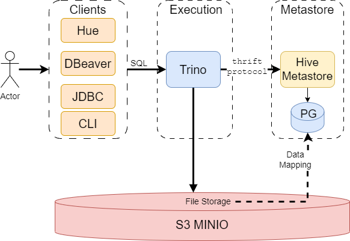

## Table of Contents

* [Overview](#overview)
* [User Guide](docs/public/user-guide.md)
* [Architecture](docs/public/architecture.md)
* [Installation Guide](docs/public/installation.md)
* [Helm Chart Customizations](#helm-chart-customizations)

## Overview
Trino is a distributed SQL query engine for Big Data analytics.  
It consists of coordinator, workers and a client should be used to submit queries to Trino.

This repo contains helm charts and images to run trino on kubernetes. The trino charts based on [trino charts](https://github.com/trinodb/charts) . The trino images include some additional improvements, for example, to work with S3 or with certificates.

The final helm chart for this project can be extracted from qubership-trino-on-k8s-transfer release image.

Trino's official documentation - https://trino.io/docs/current/overview.html.



---

## Helm Chart Customizations

This section documents the custom modifications made to the Trino Helm chart used in this deployment.

### `values.yaml`

```yaml
image:
    repository: ghcr.io/netcracker/qubership-trino
    tag: main
cloudIntegrationEnabled: false
server:
  node:
  config:
    http:
      port: 8080
    https:
      keystore:
        path: /etc/trino/certs/tls-combined.pem
    query:
      maxMemory: "2GB"
  coordinatorExtraConfig: |
    http-server.process-forwarded=IGNORE
s3: 
  endpoint: http://minio.your.cloud.qubeship.com
  accesskey: minioaccesskey
  secretkey: miniosecretkey
  region: region

hive:
  host: hive-metastore.hive-metastore.svc
  port: 9083
catalogs:
  hive: |
    connector.name=hive
    hive.metastore.uri={{ include "hive.metastore.uri" . }}
    hive.max-partitions-per-scan=1000000
    hive.storage-format=ORC
    hive.non-managed-table-writes-enabled=true
    fs.native-s3.enabled=true
    s3.endpoint={{ include "s3.endpoint" . }}
    s3.region={{ .Values.s3.region }}
    s3.aws-access-key={{ include "s3.accesskey" . }}
    s3.aws-secret-key={{ include "s3.secretkey" . }}
    s3.path-style-access=true
    s3.max-connections=100
 
containerSecurityContext:
  runAsNonRoot: true
  seccompProfile:
    type: RuntimeDefault
coordinator:
  priorityClassName: ~
  
  jvm:
    maxHeapSize: "1638M"
  resources:
    limits:
      cpu: 500m
      memory: 2G
    requests:
      cpu: 100m
      memory: 1512Mi
worker:
  priorityClassName: ~
  jvm:
    maxHeapSize: "2457M"
    
   resources:
    limits:
      cpu: 500m
      memory: 3G
    requests:
      cpu: 100m
      memory: 2G
jmx:
  
  exporter:
    image: bitnami/jmx-exporter:latest
commonLabels:
  app.kubernetes.io/part-of: trino
tls:
  enabled: false
  secretMounts:
    name: cert
    secretName: trino-server-tls-cert
    path: /etc/trino/certs/
  generateCerts:
    enabled: false
    secretName: trino-cm-tls-cert
    secretMounts:
      - mountPath: /home/trino/trustcerts/ca.crt
        subPath: ca.crt
      - mountPath: /etc/trino/certs/
    duration: 365
    subjectAlternativeName:
      additionalDnsNames: [ ]
      additionalIpAddresses: [ ]
    clusterIssuerName: common-cluster-issuer
```

---

### `_helpers.tpl`

```yaml
#--Qubership custom change---
{{ define "trino_image" -}}
{{ printf "%s:%v" (.Values.image.repository) (.Values.image.tag) }}
{{- end }}
#--Qubership custom change---


{{/*
Common labels
*/}}
{{- define "trino.labels" -}}
helm.sh/chart: {{ include "trino.chart" . }}
{{ include "trino.selectorLabels" . }}
{{- if .Chart.AppVersion }}
#--Qubership custom-label-value-change-
app.kubernetes.io/version: {{ splitList ":" ( include "trino_image" . ) | last | quote }}
#--Qubership custom-label-value-change-
{{- end }}
app.kubernetes.io/managed-by: {{ .Release.Service }}
{{- if .Values.commonLabels }}
{{ tpl (toYaml .Values.commonLabels) . }}
{{- end }}
{{- end }}

# Qubership custom change: Qubership release support
{{/*
To add to service labels for cloud release
*/}}
{{- define "to_add_to_service_labels" -}}
name: {{ include "trino.name" . }}
{{- end }}

{{/*
To add to deployment label for cloud release
*/}}
{{- define "to_add_to_deployment_labels" -}}
name: {{ include "trino.name" . }}
{{- end }}

{{/*
Processed by cert-manager label for cloud release
*/}}
{{- define "cert_manager_label" -}}
app.kubernetes.io/processed-by-operator: cert-manager
{{- end }}
```
---

### `deployment-coordinator.yaml`

```yaml
metadata:
  labels:
# Qubership custom change: Qubership release support
    {{- include "to_add_to_deployment_labels" . | nindent 4 }}
spec: 
  template:
    metadata:
        labels:
            # Qubership custom change: Qubership release support
            {{- include "to_add_to_deployment_labels" . | nindent 8 }}
    spec:
      {{- if .Values.coordinator.priorityClassName }}
      priorityClassName: {{ .Values.coordinator.priorityClassName }}
      {{- end }}
      volumes: 
        {{- if and .Values.server.config.https.enabled .Values.tls.enabled }}
        {{- if not .Values.tls.generateCerts.enabled }}
        - name: {{ .Values.tls.secretMounts.name }}
          secret:
            secretName: {{ .Values.tls.secretMounts.secretName }}
        {{- end }}
        {{- end }}
        # Qubership custom change: support secure connections
        {{- if and .Values.tls.enabled .Values.tls.generateCerts.enabled }}
        - name: {{.Values.tls.generateCerts.secretName }}-volume
          secret:
            secretName: {{.Values.tls.generateCerts.secretName }}
        {{- end }}
        containers:
            - name: {{ .Chart.Name }}-coordinator
            volumeMounts:
                {{- if and .Values.server.config.https.enabled .Values.tls.enabled }}
            {{- if not .Values.tls.generateCerts.enabled }}
            - mountPath: {{ .Values.tls.secretMounts.path }}
              name: {{ .Values.tls.secretMounts.name }}
            {{- end }}
            {{- end }}
            # Qubership custom change: support secure connections
            {{- if and .Values.tls.enabled .Values.tls.generateCerts.enabled }}
            {{- range .Values.tls.generateCerts.secretMounts }}
            - name: {{ $.Values.tls.generateCerts.secretName }}-volume
              mountPath: {{ .mountPath }}
              {{- if .subPath }}
              subPath: {{ .subPath }}
              {{- end }}
            {{- end }}
            {{- end }}
            ports:
              protocol: TCP
            {{- if .Values.server.config.https.enabled }}
            - name: https
              containerPort: {{ .Values.server.config.https.port }}
              protocol: TCP
            {{- end }}
    
```

---

### `deployment-worker.yaml`

```yaml
metadata:
  
  labels:
    
# Qubership custom change: Qubership release support
    {{- include "to_add_to_deployment_labels" . | nindent 4 }}
spec:
  template:
    metadata:
        labels:
        
# Qubership custom change: Qubership release support
        {{- include "to_add_to_deployment_labels" . | nindent 8 }}
    spec:
      {{- if .Values.worker.priorityClassName }}
      priorityClassName: {{ .Values.worker.priorityClassName }}
      {{- end }}
      volumes:
        {{- if and .Values.server.config.https.enabled .Values.tls.enabled }}
        {{- if not .Values.tls.generateCerts.enabled }}
        - name: {{ .Values.tls.secretMounts.name }}
        secret:
          secretName: {{ .Values.tls.secretMounts.secretName }}
        {{- end }}
        {{- end }}
        # Qubership custom change: support secure connections
        {{- if and .Values.tls.enabled .Values.tls.generateCerts.enabled }}
        - name: {{.Values.tls.generateCerts.secretName }}-volume
          secret:
            secretName: {{.Values.tls.generateCerts.secretName }}
        {{- end}}
       containers:
        - name: {{ .Chart.Name }}-worker
          volumeMounts:
            {{- if and .Values.server.config.https.enabled .Values.tls.enabled }}
            {{- if not .Values.tls.generateCerts.enabled }}
            - mountPath: {{ .Values.tls.secretMounts.path }}
              name: {{ .Values.tls.secretMounts.name }}
            {{- end }}
            {{- end }}
            # Qubership custom change: support secure connections
            {{- if and .Values.tls.enabled .Values.tls.generateCerts.enabled }}
            {{- range .Values.tls.generateCerts.secretMounts }}
            - name: {{ $.Values.tls.generateCerts.secretName }}-volume
              mountPath: {{ .mountPath }}
              {{- if .subPath }}
              subPath: {{ .subPath }}
              {{- end }}
            {{- end }}
            {{- end }}
          ports:
            {{- if .Values.server.config.https.enabled }}
            - name: https
            containerPort: {{ .Values.server.config.https.port }}
            protocol: TCP
            {{- end }}
```

---

### `ingress.yaml`

```yaml
spec:
    rules:
    {{- range .Values.ingress.hosts }}
    - host: {{ .host | quote }}
      http:
        paths:
          {{- range .paths }}
          - path: {{ .path }}
            pathType: {{ .pathType }}
            backend:
              service:
                name: {{ include "trino.fullname" $ }}
                port:
                {{- if gt (len $.Values.ingress.tls) 0}}
                  number: {{ $.Values.server.config.https.port }}
                {{- else }}
                  number: {{ $.Values.service.port }}
                {{- end }}
        
```

---

### `service-coordinator.yaml`

```yaml
metadata:
 
  labels:
    
# Qubership custom change: Qubership release support
    {{- include "to_add_to_service_labels" . | nindent 4 }}
    
spec:
  
  ports:
    - port: {{ .Values.service.port }}
      targetPort: http
      protocol: TCP
      name: http
      #--Qubership custom chang---#
      {{ if .Values.service.type }}
      {{ if eq .Values.service.type "NodePort" }}
      {{- if .Values.service.nodePort }}
      nodePort: {{ .Values.service.nodePort }}
      {{- end }}
      {{- end }}
      {{- end }}
  {{- if .Values.server.config.https.enabled }}
      - port: { { .Values.server.config.https.port } }
        targetPort: https
        protocol: TCP
        name: https
        nodePort: {{ .Values.server.config.https.nodeport }}
  {{- end }}
      #--Qubership custom change---#
```
### `extrasecrets.yaml`

```
This is Qubership custom template.
Provision extra Kubernetes Secrets via Helm values.

Purpose:
This template was introduced to support dynamic and reusable secret creation
from Helm values, particularly to reuse secrets from the Airflow deployment
or other shared components. It simplifies secret management in the chart and
ensures consistency across deployments by allowing values-driven secret definitions.

These secrets are provisioned as Helm hooks to ensure they are available
before the application starts, during `pre-install` and `pre-upgrade` phases.

```
---

### `secret-catalog.yaml`

```
This is Qubership custom Secret template.
It was added to manage Trino catalog configuration files in a secure, dynamic, and reusable way using Helm.

Purpose:
To provide catalog .properties files (like user-defined catalogs) required by Trino to connect to different data sources.

To support Helm-based customization of Trino deployments across environments (e.g., dev, staging, prod) without hardcoding catalog configurations.

```
---

### `secret-tls.yaml`

```
This is Qubership custom Secret template.
This template provisions a Kubernetes Secret containing a TLS certificate (tls-combined.pem) only when:

HTTPS is enabled for the Trino server

TLS is enabled in the values

Auto-generation of certificates is disabled (i.e., user is supplying their own certificates)

Purpose:
To securely provide a pre-generated TLS certificate for enabling HTTPS in Trino.

It supports use cases where organizations manage TLS certificates externally (e.g. through cert-manager or offline provisioning) and need to supply them directly

```
---

### `tls-certificate.yaml`

```
This is Qubership custom template.
Automatically provision a TLS certificate for Trino using cert-manager.

Purpose:
This template provisions a Certificate resource (cert-manager.io/v1) to enable HTTPS
on the Trino server by auto-generating a TLS certificate when enabled via Helm values.

It uses helper templates to dynamically generate Subject Alternative Names,
including:
  - Default Kubernetes service DNS names (trino, trino.namespace.svc, etc.)
  - Localhost and 127.0.0.1
  - Any additional SANs provided via values.

The certificate is issued by a specified cert-manager Issuer or ClusterIssuer and is
used by the Trino server for secure communication.

Hooks ensure the certificate is ready before installation or upgrade begins.

```
---

### `tls-issuer.yaml`

```
This is Qubership custom template.
Provision a self-signed cert-manager Issuer for Trino TLS.

Purpose:
This template creates a cert-manager `Issuer` resource used to self-sign
TLS certificates when tls generate Certs is enabled

It enables HTTPS on the Trino server in development or testing environments
without relying on an external Certificate Authority or a ClusterIssuer.
 
This `Issuer` is referenced by the `Certificate` resource, allowing
cert-manager to generate a TLS certificate using the self-signed method.
It simplifies local deployments and avoids external CA dependencies.

```
---
